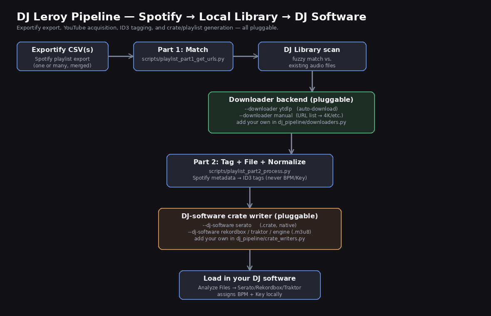
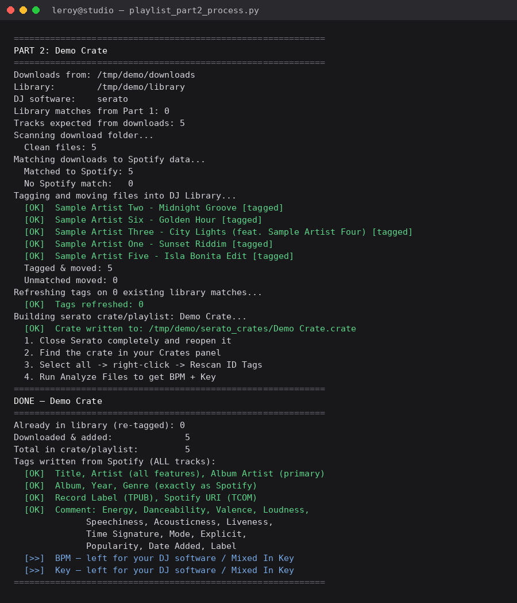

# DJ Leroy Pipeline

**Turn a Spotify playlist into a fully-tagged, DJ-software-ready crate — automatically.**

This is a two-step Python pipeline that takes a playlist exported from Spotify (via [Exportify](https://exportify.net)), matches it against your existing local library, acquires whatever's missing from YouTube, writes rich Spotify metadata (genre, energy, danceability, label, and more) into every file's ID3 tags, organizes everything into a clean `Artist/Album/Title.mp3` structure, and builds a crate or playlist your DJ software can load directly. BPM and musical Key are deliberately never written by the script — that's left to your DJ software (or Mixed In Key) to analyze locally, so those values are always freshly computed from the actual audio.

It exists because manually re-building a DJ library from Spotify playlists — matching what you already own, hunting down the rest on YouTube, tagging every file by hand, and rebuilding crates — doesn't scale past a handful of playlists. This pipeline was built and tested scaling to 100+ playlists across multiple genres.

> **Status:** personal-tooling snapshot, not a packaged product. It's built for one DJ's real Mac setup and has been generalized here so anyone can point it at their own paths, downloader, and DJ software — see [Intended Use & Limitations](#intended-use--limitations) below.

---

## Architecture



```
Exportify CSV(s)
      │
      ▼
Part 1 — match against your DJ Library (fuzzy filename/metadata match)
      │
      ├── already have it → recorded for re-tagging
      └── missing → resolved by your chosen DOWNLOADER backend
                       │
                       ▼
Part 2 — tag every file with Spotify metadata, file it into
         Artist/Album/Title.mp3, normalize volume, then build
         a crate/playlist using your chosen DJ-SOFTWARE backend
      │
      ▼
Load the crate/playlist in your DJ software → it analyzes BPM + Key locally
```

**The two things that used to require hand-editing scripts are now flags:**

| What | Old workflow | Now |
|---|---|---|
| How tracks get downloaded | Manually edit script, paste URLs into 4K one at a time | `--downloader ytdlp` (fully automatic) or `--downloader manual` (URL list, any GUI tool) |
| Which DJ software gets the crate | Hardcoded Serato binary writer | `--dj-software serato\|rekordbox\|traktor\|engine\|virtualdj\|m3u` |
| Playlist name / paths | Hand-edited `CONFIG` block at the top of the script | CLI flags with sane defaults, saved to a session file so Part 2 auto-finds them |

---

## What's included

```
dj-leroy-pipeline/
├── dj_pipeline/                 # Shared library code (importable, testable)
│   ├── config.py                 # Paths, session handoff, CLI defaults
│   ├── downloaders.py            # Pluggable YouTube acquisition backends
│   ├── crate_writers.py          # Pluggable DJ-software crate/playlist writers
│   ├── matching.py               # Fuzzy library/download matching logic
│   └── tagging.py                # ID3 tag writer (Spotify → MP3 metadata)
├── scripts/
│   ├── playlist_part1_get_urls.py    # Step 1: match + resolve missing tracks
│   ├── playlist_part2_process.py     # Step 2: tag, file, normalize, build crate
│   └── cleanup_duplicates.py         # Post-session duplicate cleanup
├── examples/
│   └── sample_playlist_export.csv    # Mock Exportify CSV (5 fictional tracks)
├── docs/
│   ├── PIPELINE_REFERENCE.md         # Full CLI reference, tag rules, formats
│   ├── DOWNLOADERS.md                # How to add a new downloader backend
│   ├── DJ_SOFTWARE.md                # How to add a new crate/playlist format
│   └── images/                       # Diagrams and sample-run screenshots
├── requirements.txt
├── QUICKSTART.md
├── PUSH_TO_GITHUB.md
├── setup_github.sh
├── LICENSE
└── .gitignore
```

---

## Examples

**Example 1 — fully automated, Serato (recommended default)**
```bash
python3 scripts/playlist_part1_get_urls.py \
  --csv examples/sample_playlist_export.csv \
  --name "Demo Crate" --downloader ytdlp
python3 scripts/playlist_part2_process.py --name "Demo Crate" --dj-software serato
```

**Example 2 — manual 4K-style workflow, Rekordbox output**
```bash
python3 scripts/playlist_part1_get_urls.py \
  --csv examples/sample_playlist_export.csv \
  --name "Demo Crate" --downloader manual
# paste the generated URL list into 4K YouTube to MP3 (or any GUI downloader)
python3 scripts/playlist_part2_process.py --name "Demo Crate" --dj-software rekordbox
```

**Example 3 — merging several playlists into one crate**
```bash
python3 scripts/playlist_part1_get_urls.py \
  --csv playlist_1.csv --csv playlist_2.csv --csv playlist_3.csv \
  --name "Summer 2026 Mix" --downloader ytdlp
python3 scripts/playlist_part2_process.py --name "Summer 2026 Mix"
```

See [docs/PIPELINE_REFERENCE.md](docs/PIPELINE_REFERENCE.md) for every flag.

---

## Quick Start

Full zero-to-running walkthrough (including how to get this off GitHub) is in **[QUICKSTART.md](QUICKSTART.md)**. Short version:

```bash
git clone https://github.com/YOUR_USERNAME/dj-leroy-pipeline.git
cd dj-leroy-pipeline
pip install -r requirements.txt --break-system-packages   # or use a venv
brew install mp3gain ffmpeg      # macOS; see QUICKSTART.md for other OSes

python3 scripts/playlist_part1_get_urls.py \
  --csv examples/sample_playlist_export.csv \
  --name "My First Crate" --downloader ytdlp \
  --library ~/Music/DJ\ Library

python3 scripts/playlist_part2_process.py --name "My First Crate" --dj-software serato
```

---

## Sample output

A real run of Part 2 against the included example CSV (library/crate paths are demo paths, not real ones):



---

## Tag rules (the part that must never change)

| Tag | Rule |
|---|---|
| Title / Artist / Album | From Spotify, verbatim |
| Album Artist | Primary artist only (features stripped) |
| Genre | **Exactly as Spotify provides it** — no normalization or remapping |
| Comment | Energy, Danceability, Valence, Loudness, Speechiness, Acousticness, Liveness, Time Signature, Mode, Explicit, Popularity, Date Added, Label, Spotify URI |
| **BPM** | **Never written by this pipeline** — left for your DJ software / Mixed In Key |
| **Key** | **Never written by this pipeline** — left for your DJ software / Mixed In Key |

Full rationale in [docs/PIPELINE_REFERENCE.md](docs/PIPELINE_REFERENCE.md#tag-rules).

---

## Intended use & limitations

- This is a **personal tooling snapshot**, generalized for sharing — not a maintained product with a support channel.
- It manipulates real files on your filesystem (copies, moves, deletes "bad" downloads, writes ID3 tags). **Point it at a test folder first.**
- Fuzzy matching (library lookups, download-to-track matching) is heuristic, not exact — always spot-check a new library before trusting it fully.
- Downloading audio from YouTube may be subject to YouTube's Terms of Service and copyright law in your jurisdiction. You're responsible for how you use the `ytdlp` / `manual` downloader backends.
- No warranty, no guarantee of fitness for any purpose. See [LICENSE](LICENSE).

### Roadmap / known limitations
- Matching is filename/title-first and can miss when a downloaded file's name leads with a long artist string — see `dj_pipeline/matching.py`.
- Rekordbox/Traktor/Engine DJ export is currently a shared `.m3u8` writer (works, but doesn't set per-track cue points, hot cues, or embedded artwork the way each app's native format could).
- No SoundCloud or Apple Music input yet — Exportify CSV is the only supported source format today.
- Mixed In Key integration is a manual step between Part 2 and loading your DJ software, not yet scripted.
